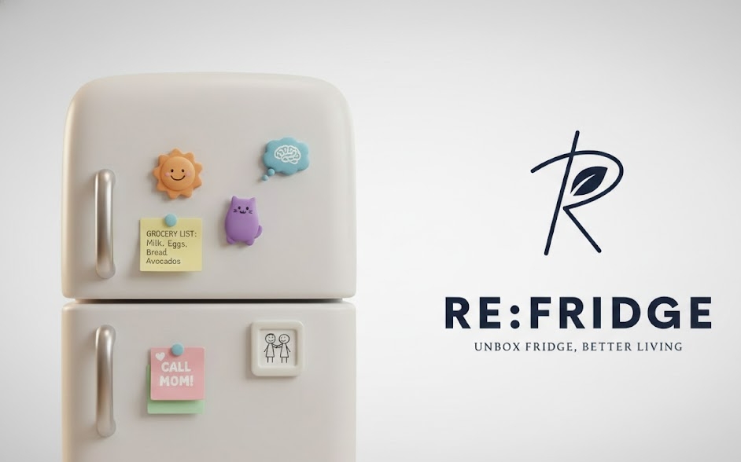

# 🧊 RE:FRIDGE
### "UNBOX FRIDGE, BETTER LIVING"

  
  
  

    <strong>리프릿지로 장바구니에서 우리 몸에 들어오기까지 일련의 과정을 한 번에 관리해보세요</strong>
  

 

## ✨ What can we do with RE:FRIDGE?

🏠 **우리 집 냉장고를 한 눈에 확인하고 쉽게 관리해요!**

💰 **배달음식에 찌든 당신!** 직접 요리하는 재미와 냉장고 관리를 통해 그 동안 얼마를 아꼈는지 알 수 있어요!

📸 **OCR 기반 / 사용자 커스텀 입력 기반**으로 구매한 상품을 한 번에 냉장고에 정리할 수 있어요!

🎥 **유튜브 링크를 통해 레시피를 텍스트로 쉽게 변환**하고, 냉장고에 있는 재료로 쉽게 추천받아요!

⏰ **유통기한 알람을 받을 수 있어요!** 소비기한까지 연장, 개인적 폐기도 가능해요!

 

## 🏗️ System Architecture

  

 

## 🛠️ Tech Stack

### **Application**

### **Back-end**

### **Database**

### **AI & Data Processing**

### **CI/CD & Infrastructure**

### **Production Environment**

 

## 📚 Related Resources

  
  &nbsp;&nbsp;&nbsp;
  

 

---

  

    <strong>RE:FRIDGE</strong> - Unbox Fridge, Better Living 🌱
  

